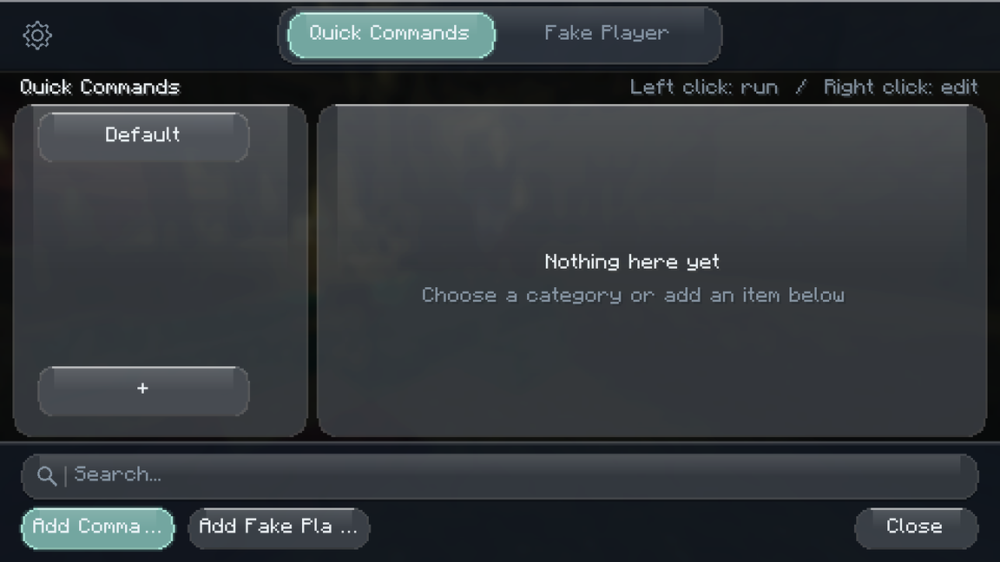
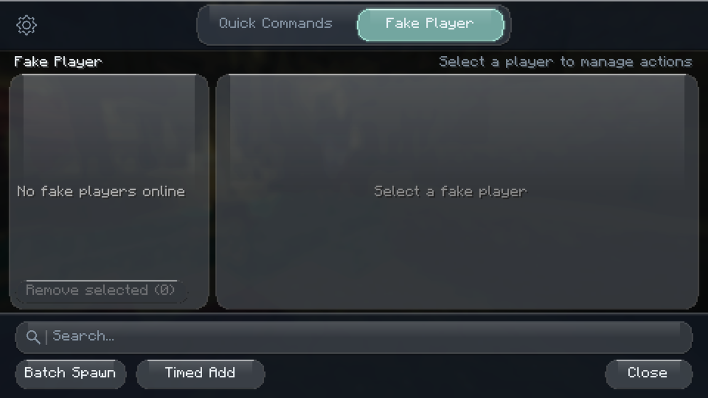
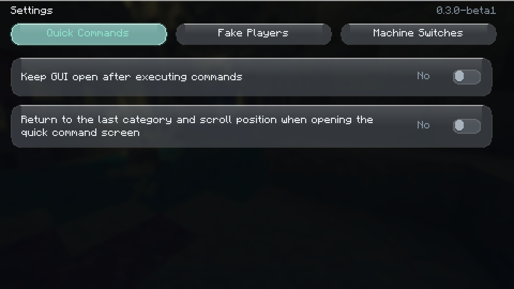
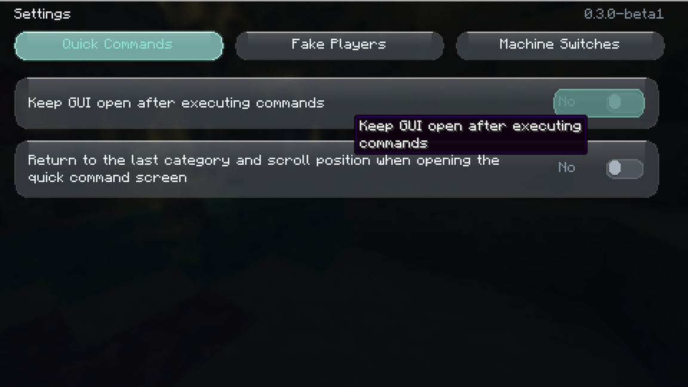

# 液态玻璃外观

界面从「不透明深色卡片」改为半透明磨砂玻璃：世界（或标题界面的全景图）先被模糊，
再压一层上浅下深的暗色，面板与控件浮在上面，靠 1px 棱边、顶部光泽和柔和投影拉开层次。

## 观感要点

- **背景**：沿用原版菜单模糊（`Options.getMenuBackgroundBlurriness()`，默认 5）。原版只在模糊度
  `>= 1` 时调用 `GuiGraphicsExtractor.blurBeforeThisStratum()`，界面层在模糊度被关掉时会自己补一次，
  保证玻璃始终有磨砂底；两者互斥，每帧只会模糊一次。
- **底板**：玻璃卡片是「亮边 + 半透明底 + 顶部光泽 + 底边暗线」四层，读起来像一块有厚度的玻璃，
  而不是一块灰色方块。
- **棱边**：亮边统一走 `GuiTheme.border()`，顶边取更高亮度，底边用暗线，形成受光方向一致的高光。
- **流动感**：鼠标悬停在按钮上时，玻璃表面会出现一道跟随光标的柔光带（`specular`），
  配合强调色外发光，接近系统级控件的反馈。
- **层次**：面板圆角 9、控件圆角 6 且高度 ≤ 22 时用胶囊形；顶部标签改为「玻璃轨道 + 浮起胶囊」
  的分段控件。

## 绘制层

全部集中在 `GuiTheme`（客户端），其余界面只调用它：

| 方法 | 用途 |
|---|---|
| `screenBackground` | 磨砂底板：模糊 + 上浅下深的压暗层 + 顶部 1px 环境光 |
| `panel` / `popup` | 玻璃卡片 / 更实的弹窗（悬浮提示、自动补全列表） |
| `row` | 列表行：玻璃底 + 悬停 / 选中态，不投影，避免长列表开销 |
| `button` | 胶囊玻璃按钮，支持选中（强调色染色 + 外发光）、禁用与 hover 柔光 |
| `rounded` / `outline` / `divider` | 圆角、描边、分隔线等基础图元 |

`rounded()` 每个圆角行一次 `fill`：大面板半径大但数量少，列表行和按钮半径小且只画可见行，
所以绘制量与旧版同级，不随内容量增长。

## 调参

所有颜色、圆角都走 `GuiTuning`，可用 `config/command-gui/gui-tuning.json` 覆盖，键名在
`devtools/tuning-schema.json`（分组「液态玻璃主题」）。常用键：

| 键 | 说明 |
|---|---|
| `GuiTheme.SCRIM_TOP` / `SCRIM_BOTTOM` | 背景压暗层（上 / 下） |
| `GuiTheme.PANEL` / `PANEL_STRONG` | 玻璃卡片 / 弹窗底板 |
| `GuiTheme.SURFACE` / `HOVER` / `SELECTED` | 控件常态 / 悬停 / 选中态 |
| `GuiTheme.BORDER` / `SHEEN` / `SHADOW` | 棱边 / 顶部光泽 / 投影 |
| `GuiTheme.RADIUS` / `PANEL_RADIUS` | 控件 / 面板圆角 |
| `GuiTheme.BLUR_ENABLED` | `0` 时尊重原版模糊设置，不再强制磨砂 |

`devtools/gui-tuning.json` 是全部键的默认值快照，可直接复制到
`config/command-gui/gui-tuning.json` 再改；改完重新打开界面即可生效，不用重新打包。

## 验证

`tests/gui-theme/` 是一段只截图的客户端 QA（不进发布 jar）：

```bash
./gradlew runClient -I tests/gui-theme/init.gradle
```

它会在标题界面打开主界面，依次切到各标签、设置页，并把光标移到按钮上验证 hover 高光，
截图写到 `build/gui-theme-qa/screenshots/`：






上述截图取自 2026-09-12、1440×810、模糊度 5、GUI 缩放 3 的实测客户端。
