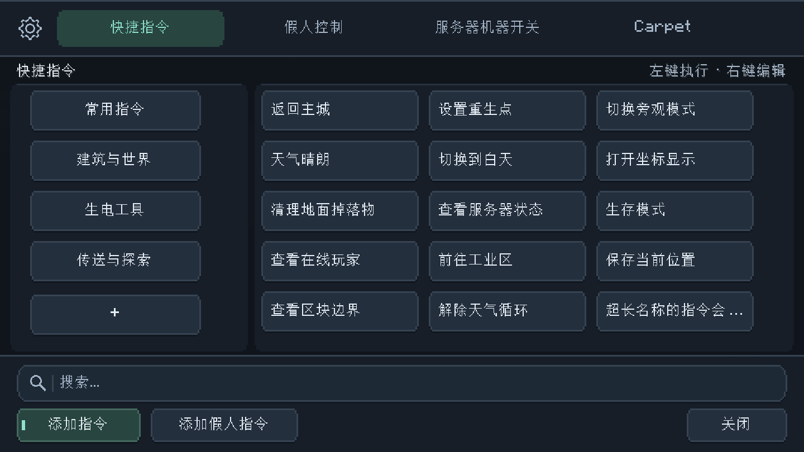
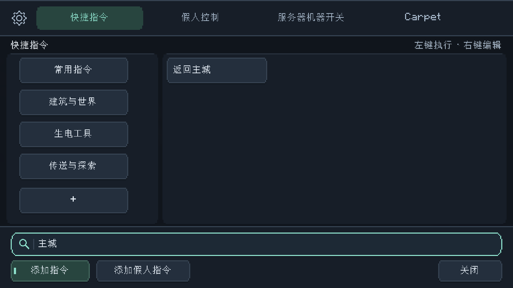
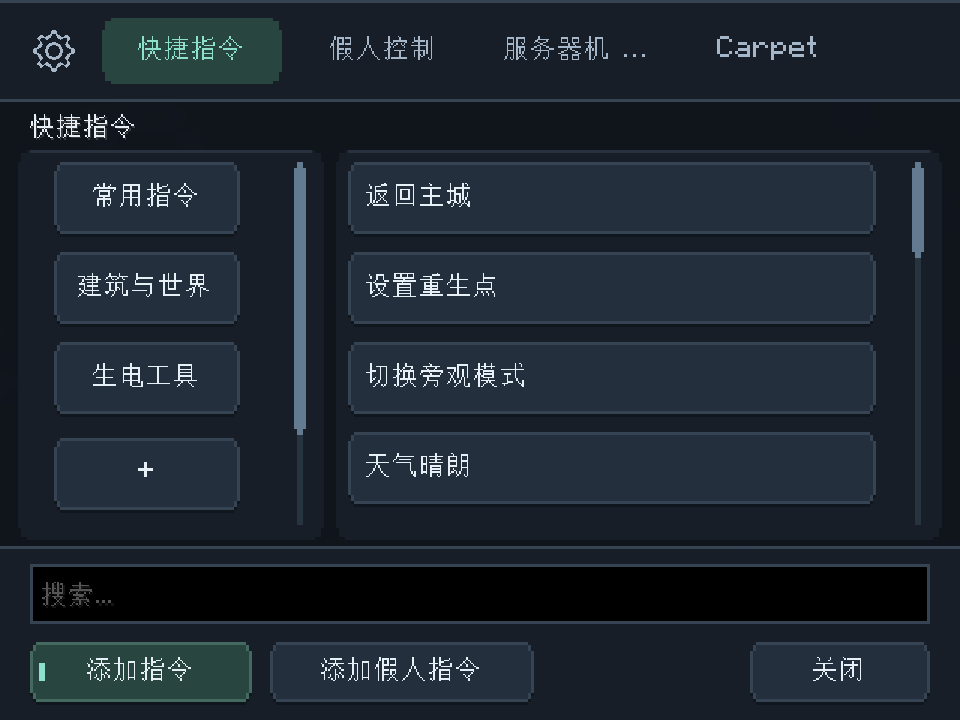
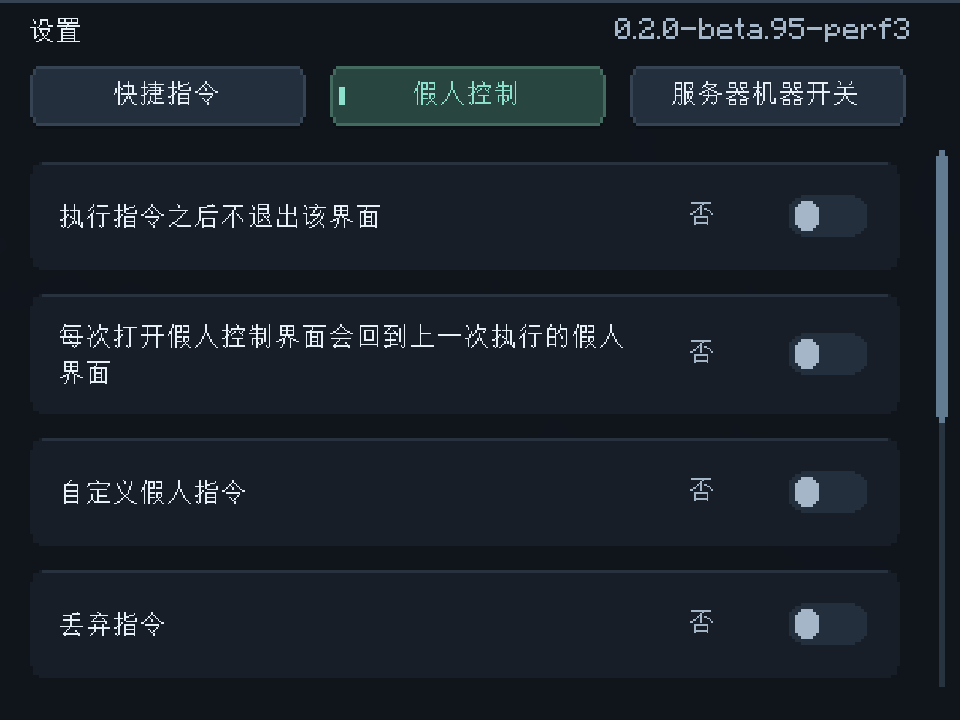
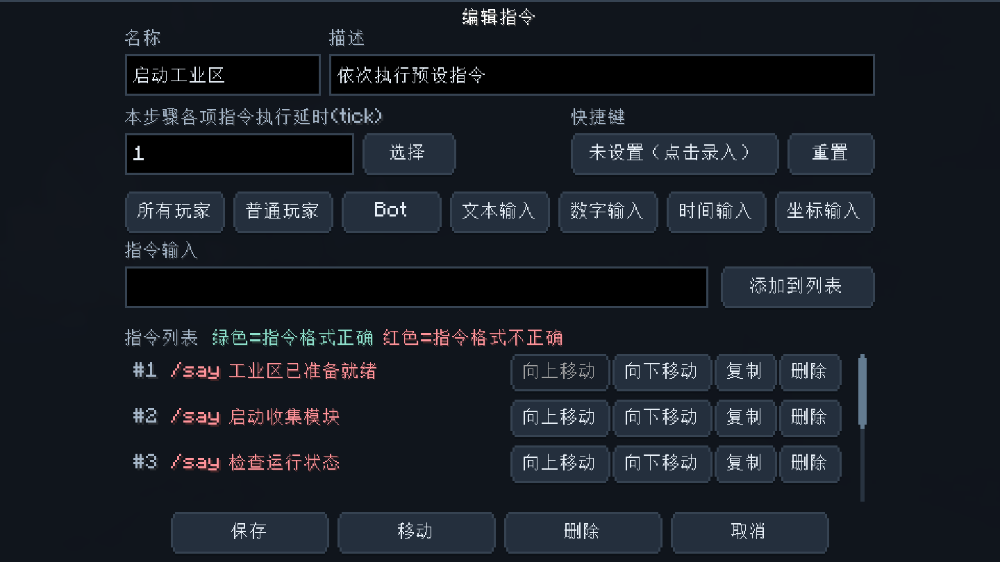
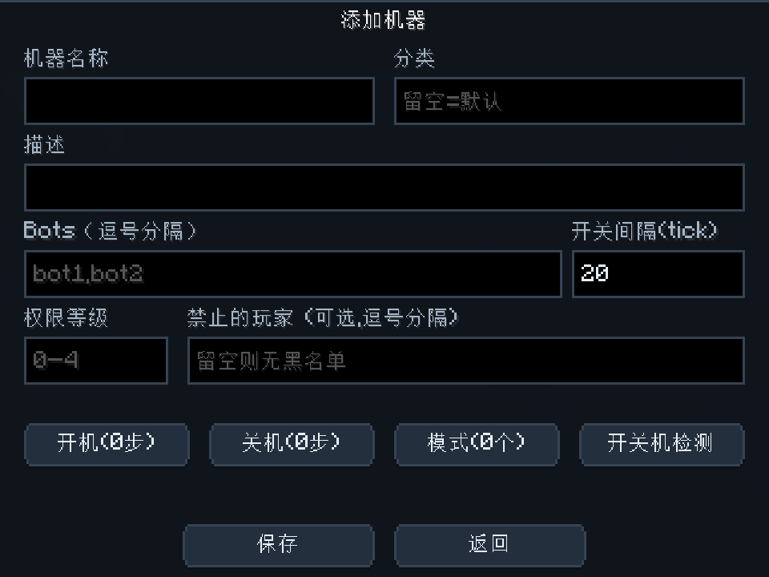

# 游戏内界面整理

基于 `origin/main` 的 `e1d9d58`，本地分支为 `ui/main-polish`。

项目使用 Minecraft 26.2 / Fabric / Java 25。游戏内界面由 `CommandGUIScreen` 组织快捷指令、假人、机器和预设标签页，各编辑页通过 `BaseParentedScreen` 返回上级页面。本次改动集中在这个客户端显示层。

## 改动

- 深色背景、分区面板和青绿色强调色；选中、悬停、键盘焦点、禁用状态分开显示。
- `GuiTheme` 集中管理配色和绘制；`GuiButton`、`GuiEditBox`、`GuiTabBar` 复用 Minecraft 的控件事件、文本编辑和导航能力。
- 统一主界面与编辑页的按钮、输入框、图标和滚动条。短标签直接显示，长标签按真实可用宽度截断；输入提示限制在输入框内。
- 底部改为搜索和操作两行，机器的筛选、添加、保存不再争用搜索框的位置；收拢重复的底部控件显隐代码。
- 指令网格根据可用宽度选择一至三列；预设指令的命中检测使用实际按钮位置，兼容列数变化。
- 分类侧栏增加留白和选中标记；机器行统一间距并给状态增加色条；没有滚动内容时不再显示整条白色滑块。
- 搜索无结果和空分类提供中英文提示。

第二轮细化：

- 分类栏和主列表统一为 30 像素行距、24 像素按钮，保留 6 像素空隙；指令编辑列表改为 22 像素行距、18 像素按钮，时间轴和模式列表改为 26 / 20。绘制、可见行数、滚动与命中检测使用相同的行距。
- 设置图标改为代码绘制的八齿轮廓和圆形轴心，按 GUI 缩放显示；悬停和键盘聚焦使用强调色。
- 石墨灰面板、细描边、小圆角、轻阴影与更安静的标签导航；减少按钮文字阴影，统一状态配色。
- 设置项使用独立行面板和滑动开关，长说明根据实际宽度换行；修正滚动时文字与控件越过内容区域的问题。
- 修正权限等级标签碰撞、时间轴底部循环设置拥挤、模式配置按钮重叠；模式和步骤名称按按钮的实际宽度截断，并保留完整提示。
- 假人操作网格增加行列间隔，循环点击设置分成输入和操作两行，宽度随面板变化。
- 搜索框改为独立的 `GuiSearchBox`：使用圆角底板、代码绘制的放大镜、图标分隔线和青绿色焦点描边。内部继续使用 Minecraft 原生文本编辑器，保留中文输入、光标定位、选区、复制粘贴和长文本滚动。

`server/`、客户端网络同步、数据模型、配置存取、指令执行与构建配置的源码均未修改。已有命令回调、机器操作与编辑流程沿用原实现。

## 实际渲染截图

截图由隔离的 Fabric 客户端生成，使用示例数据。

常规窗口：1440 × 810，GUI 缩放 3。

搜索框聚焦及搜索结果：

窄窗口：960 × 720，GUI 缩放 3，指令自动改为单列。

设置项换行及开关：

多行指令编辑：

窄窗口的机器编辑：

## 验证

- JDK 25，`gradlew.bat build -x bumpVersion --offline` 构建通过，版本号未自动递增。
- 独立客户端完成 17 个状态的截图检查：快捷指令、机器列表、假人空状态、设置、多行指令、搜索无结果、窄窗口、机器编辑、时间轴、模式列表、设置滚动、步骤编辑，以及假人操作面板的首尾状态。最终一轮没有可见控件越界或相互重叠的报告。
- 假人操作面板通过隔离的选中状态检查布局，未连接游戏服务器；截图夹具和示例数据不包含在正式 JAR 内。
- 搜索框单独完成空闲、聚焦、中文输入、全选、删除、超长文本、窄窗口、机器筛选和拖动选区检查；输入与筛选行为均通过。
- 中英文 JSON 解析及 `git diff --check` 通过。
- 通过 Git 差异检查确认业务层源码未变更。

这是客户端渲染检查，未连接实际服务器测试指令、机器调度或假人行为。当前 main 没有单元测试源，Gradle 的 test 任务显示 NO-SOURCE。

## 构建产物与调色

客户端安装包：`build/libs/command-gui-0.2.0-beta.95-perf3.jar`。

新颜色继续支持 `config/command-gui/gui-tuning.json` 中的 `GuiTheme.*` 配置项，例如 `BACKGROUND`、`PANEL`、`SURFACE`、`HOVER`、`BORDER`、`ACCENT`、`SELECTED`、`TEXT`、`MUTED`、`DISABLED`、`DANGER`、`WARNING`。值使用 ARGB 整数；源码保留默认值。顶部、底部和分类间距设置了最小尺寸，避免控件与面板重叠。

仓库中的 DevStudio 网页预览仍采用原布局，界面效果请以本页的游戏客户端截图为准。

